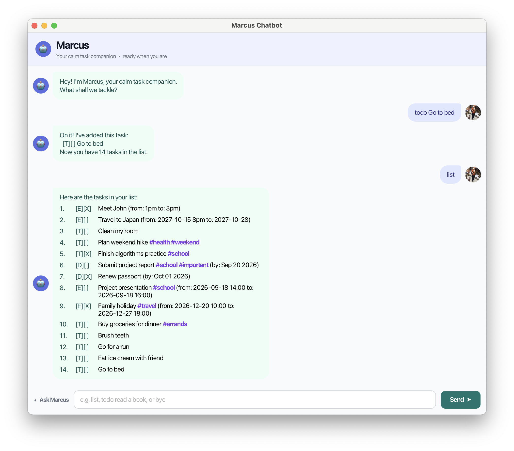

# Marcus User Guide

## About Marcus

Marcus is a friendly task-management chatbot. He helps you keep track of
to-dos, deadlines, events, and tags through either the command line or the
JavaFX graphical interface.



## Getting started

Make sure Java 25 is installed. From the project root, start the graphical
interface with:

```bash
./gradlew run
```

To run the console version, compile the project and start the `marcus.Marcus`
entry point:

```text
./gradlew classes
java -cp build/classes/java/main marcus.Marcus
```

Type a command in the input field or terminal and press Enter. In the GUI, you
can also click **Send**. Use `bye` to end the session.

## Creating tasks

### To-dos

To create a task without a date or time, use:

```text
todo <description>
```

Example:

```text
todo read a book
```

### Deadlines

To create a task that is due on a specific date, use:

```text
deadline <description> /by <yyyy-mm-dd>
```

Example:

```text
deadline submit project report /by 2026-09-20
```

Dates must be real calendar dates. For example, `2026-02-30` is invalid.

### Events

To create an event with a start and end time, use:

```text
event <description> /from <start> /to <end>
```

Examples:

```text
event project presentation /from 2026-09-18 14:00 /to 2026-09-18 16:00
event dinner with friends /from Friday 7pm /to Friday 9pm
```

ISO times in `yyyy-mm-dd HH:mm` format can be searched by date. Free-text
times are displayed but cannot be matched by date searches. When both times
use the ISO format, the end time must be later than the start time.

## Viewing and searching tasks

List every task:

```text
list
```

Search task descriptions with a keyword:

```text
find <keyword>
```

Example:

```text
find report
```

Search dated deadlines and ISO-timed events:

```text
find <yyyy-mm-dd>
```

Task numbers remain the original numbers in search results, so you can use
them with commands such as `mark` and `delete`.

## Completing and deleting tasks

Mark a task as complete:

```text
mark <task number>
```

Mark it as incomplete again:

```text
unmark <task number>
```

Delete a task:

```text
delete <task number>
```

Task numbers start at 1 and are shown by `list`.

## Tagging tasks

Tags help group related tasks. A tag must begin with `#`, cannot contain
spaces, and may contain letters, numbers, underscores, and hyphens.
Tags are always stored in lowercase, and duplicate tags are ignored.

Add one or more tags:

```text
tag <task number> <tag> [tag ...]
```

Example:

```text
tag 1 #school #important
```

Remove one tag:

```text
untag <task number> <tag>
```

Remove every tag from a task:

```text
untag <task number> all
```

Search specifically by tag:

```text
find #school
list #school
```

Tags appear in tag-search results and normal lists. A normal keyword search,
such as `find school`, searches task descriptions only and does not search
tags.

## Error handling

Marcus reports invalid commands without stopping the session. Common errors
include:

- Missing descriptions, dates, times, or task numbers.
- Invalid dates or incorrectly ordered event times.
- Repeated event/deadline parameters.
- Invalid tags or task numbers that do not exist.
- Duplicate tasks.
- Malformed or duplicate records in the saved data file.

Leading, trailing, and repeated spaces around a command are handled safely.
Task details cannot contain the `|` character because it is used by the saved
file format.

## Saving tasks

Tasks are saved automatically in:

```text
data/results.txt
```

The file is created when needed. Existing tasks without tags continue to load
normally. If a saved record is malformed, Marcus skips that record and keeps
loading the valid records.

## Building the JAR file

To create the distributable JAR with JavaFX bundled inside it, run:

```bash
./gradlew clean shadowJar
```

The resulting file is:

```text
build/libs/marcus.jar
```

Run it with:

```bash
java -jar build/libs/marcus.jar
```

JavaFX is bundled in this JAR, so users do not need to install JavaFX
separately.
